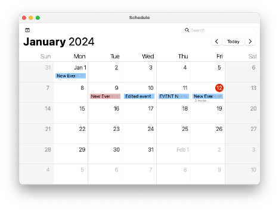
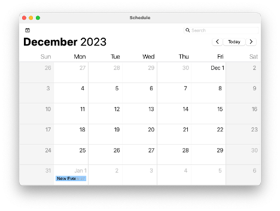
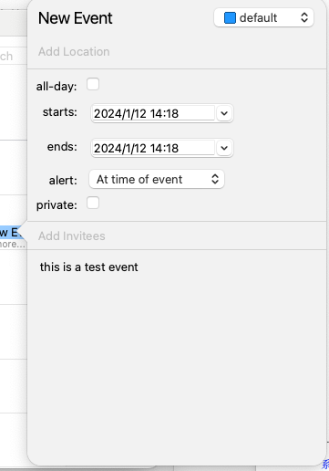
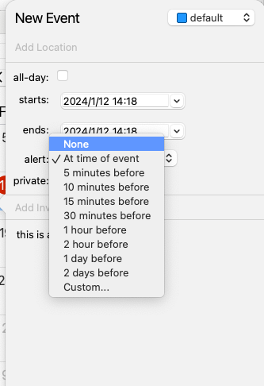
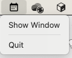

# IntelliScheduler 

> 一款使用C++Qt开发的桌面日历日程管理工具

 

该项目是一款基于Qt6和C++20开发的桌面日历日程控件程序。它具有显示月历、添加事件、事件提醒、系统托盘集成等功能。

## 主要功能

- **月历视图** 以简洁明了的方式显示当月的日历和事件
- **事件管理** 可添加、编辑和删除日程事件,支持多种事件属性设置
- **事件提醒** 可自定义提前多久进行事件开始提醒
- **系统托盘** 支持最小化到系统托盘,双击图标唤醒程序

## 快速开始

### 使用

#### 月历视图

- 单击网格查看该日事件列表
- 右键单击网格可添加或删除该日事件
- 使用月份切换按钮在不同月份间切换

#### 事件管理

- 右键新建事件或双击已有事件进行编辑
- 在弹出窗口中填写事件详情如名称、时间等
- 保存更改后事件会显示在对应日期处

#### 系统托盘

- 点击最小化按钮,程序会最小化至系统托盘
- 右键单击托盘图标可还原窗口或退出程序

## Screenshot

- **Month View:**

- **Event View:**

- **Tray Menu:**

## 开发环境

- Qt 6
- C++ 20  
- Git
- Clang
- CMake

## TODO

- **周视图** (May do)
  - 实现一周的显示布局
  - 显示和排列一周内的事件
- **事件自动安排算法**
  - 开发能够自动优化和安排事件的算法
- **搜索和过滤模块**
  - 设计并实现高效的搜索算法
  - 允许用户自定义事件过滤器
- **NLP集成**
  - 集成LLM API到应用中
  - 调用API生成自然语言处理结果
  - 将API结果集成到应用界面中
- **Google Calendar API 集成**
  - 设置Google Cloud Console，创建API密钥和OAuth 2.0客户端ID
  - 集成Google Calendar API，并实现认证过程
  - 通过API获取和显示用户的日历数据
- **日历设置和个性化模块**
  - 用户界面主题和样式的偏好设置
  - 时间格式、语言等偏好设置
  - 显示当前时区和切换时区界面
  - 处理跨时区事件的显示

## 协议

该项目基于[GNU GPL-3.0 LICENSE](LICENSE)开源。